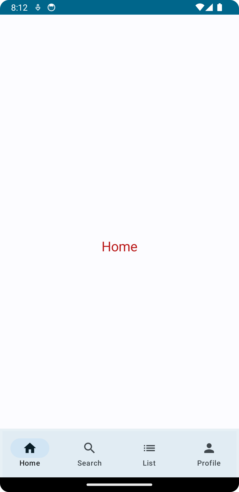
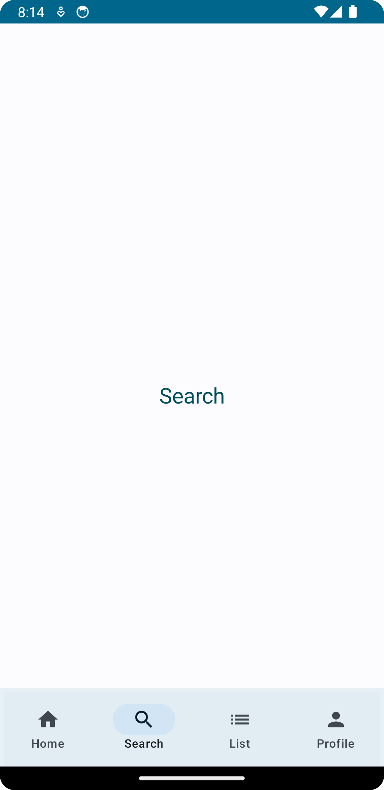
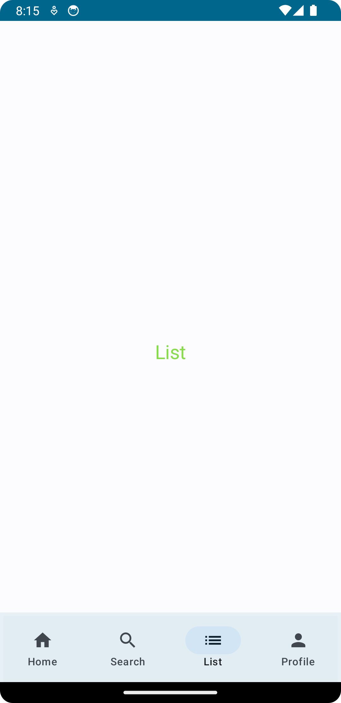
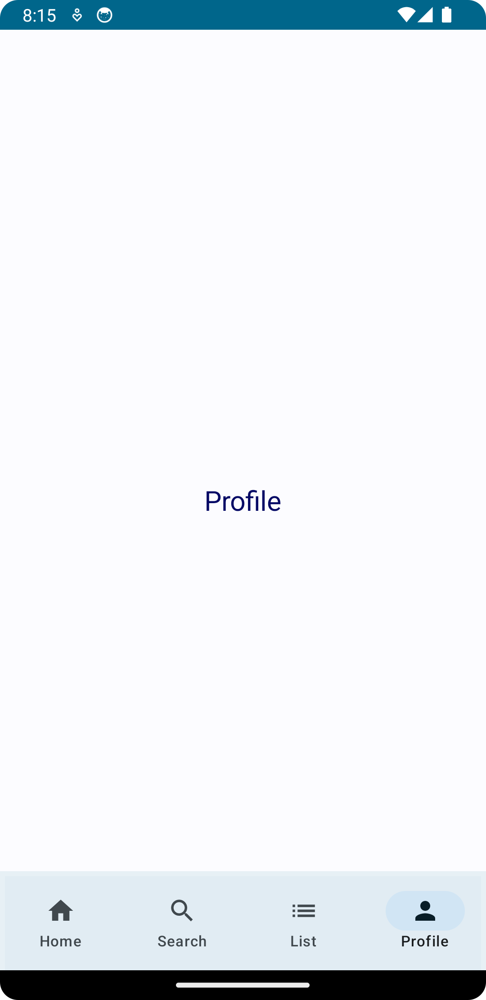

[](https://ktlint.github.io/)
[](https://developer.android.com/jetpack/compose)
[](https://kotlinlang.org/)
[](https://android-arsenal.com/api?level=21)
[](https://opensource.org/licenses/Apache-2.0)

<p align="center"> 
    
</p>

<h1 align="center"> Jetpack Compose Bottom Tab Navigation </h1>

[Jetpack Compose](https://www.googleadservices.com/pagead/aclk?sa=L&ai=DChcSEwirxJ-8nJGAAxWezMIEHZm2DusYABACGgJwdg&ohost=www.google.com&cid=CAESa-D2E9EHPMO24ZVeohcQzPgBKtfVfkbnufBlV2qUiGJ5XL1vhNoQ7Yyk9acePAcC0Xrx3KvcDy_b5pvHL3nlRFYBNebz9_mLYiGTkq45DFvSST2UrzbFYFcZWc4RNKcXC6Bs884F7_fCsX0t&sig=AOD64_1j28Y5zCwhCJe_uPcFZYyLdXxP9Q&q&adurl&ved=2ahUKEwjD8Zm8nJGAAxXPFzQIHcrGDR4Q0Qx6BAgKEAE&nis=8) is a modern UI toolkit for building native Android apps. It offers a declarative approach to UI development, simplifying the process of creating intuitive and dynamic user interfaces. With Jetpack Compose, you can easily implement features like bottom tab navigation, enabling users to [navigate](https://developer.android.com/jetpack/compose/navigation) between different sections of your app with ease. Combining the power of Jetpack Compose's declarative UI paradigm and the Navigation component, you can create seamless and engaging navigation experiences for your users.

## 🌳 Environment
Android Studio verison used : ``Android Studio Hedgehog | 2023.1.1 Canary 11``

## 🖼️ Demo Screens

| Home Screen | Search Screen |
|-------------|---------------|
| | |

| List Screen | Profile Screen |
|-------------|---------------|
| | |


## 🖥️ Code Snippets

### 1. Main Screen with Bottom Navigation

```
@Composable
fun MainScreen(navController: NavHostController) {
    Scaffold(bottomBar = {
        BottomAppBar { BottomNavigationBar(navController = navController) }
    }) { NavigationScreens(navController = navController) }
}
```
This code defines the `MainScreen` function that sets up a screen layout with a bottom app bar and main content area. It uses the `Scaffold` composable from Jetpack Compose to provide the basic structure. The `BottomAppBar` composable represents the bottom app bar, and within it, the `BottomNavigationBar` composable handles navigation. The `NavigationScreens` composable is used for the main content area, which handles navigation based on the provided `navController`.

### 2. BottomNavigationBar
```
@Composable
fun BottomNavigationBar(navController: NavHostController) {
    val navItems = listOf(NavItem.Home, NavItem.Search, NavItem.List, NavItem.Profile)
    var selectedItem by rememberSaveable { mutableStateOf(0) }

    NavigationBar {
        navItems.forEachIndexed { index, item ->
            NavigationBarItem(
                alwaysShowLabel = true,
                icon = { Icon(item.icon, contentDescription = item.title) },
                label = { Text(item.title) },
                selected = selectedItem == index,
                onClick = {
                    selectedItem = index
                    navController.navigate(item.path) {
                        navController.graph.startDestinationRoute?.let { route ->
                            popUpTo(route) { saveState = true }
                        }
                        launchSingleTop = true
                        restoreState = true
                    }
                }
            )
        }
    }
}
```

This code defines the `BottomNavigationBar` composable function, which is responsible for rendering a bottom navigation bar in a Compose UI.

Inside the function, a list of `navItems` is created, representing the navigation items such as `Home, Search, List, and Profile`. A `selectedItem` variable is also defined using the `rememberSaveable` composable, which tracks the currently selected item.

The `NavigationBar` composable is used to render the actual navigation bar UI. Within it, a forEachIndexed loop is used to iterate over the `navItems` list. For each item, a `NavigationBarItem` is rendered with the corresponding icon and label.

The selected property of each `NavigationBarItem` is set based on whether the item's index matches the `selectedItem` index. When an item is clicked, the onClick lambda is triggered. It updates the selectedItem value and then uses the `navController` to navigate to the item's specified path. Additional navigation configurations are applied using the navController.navigate function.

In summary, this code creates a reusable `bottom navigation bar` that allows users to navigate between different screens using the provided `navController`.

### 3. NavigationScreens
```
@Composable
fun NavigationScreens(navController: NavHostController) {
    NavHost(navController, startDestination = NavItem.Home.path) {
        composable(NavItem.Home.path) { HomeScreen() }
        composable(NavItem.Search.path) { SearchScreen() }
        composable(NavItem.List.path) { ListScreen() }
        composable(NavItem.Profile.path) { ProfileScreen() }
    }
}
```

This code defines the `NavigationScreens` composable that handles the navigation logic in a Compose UI. It uses a `NavHost` to host and navigate between screens based on a `NavHostController`. The `startDestination` is set to the `NavItem`.`Home.path`, indicating the initial screen. Each screen is defined using the composable function, associating a path from the `NavItem` enum with a specific screen composable. This setup enables seamless navigation between screens using the provided `NavHostController`.

For detailed information, you can check the whole code. 

## 💰 Bonus Knowledge

In this project, we have utilized [TOML (Tom's Obvious, Minimal Language)](https://developer.android.com/build/migrate-to-catalogs) as a configuration file format for managing `Gradle dependencies and plugins`. TOML provides a clean and easy-to-read syntax, making it simpler to manage and maintain the project's dependencies.

By using a TOML file, we can define and organize our Gradle dependencies and plugins in a structured manner. This approach enhances the `readability and maintainability` of our build configuration.

The TOML file in this project serves as a `centralized location` to specify the required dependencies and plugins, ensuring consistency across different build scripts. By utilizing TOML, we have streamlined the process of managing dependencies and plugins, making the project more efficient and easier to maintain.

Here is a basic example of what we can achieve with TOML:

## From

```
// Top-level `build.gradle.kts` file
plugins {
   id("com.android.application") version "7.4.1" apply false
}

// Module-level `build.gradle.kts` file
plugins {
   id("com.android.application")
}
dependencies {
    implementation("androidx.core:core-ktx:1.9.0")
}
```

## To
```
// Top-level build.gradle.kts
plugins {
   alias(libs.plugins.android.application) apply false
}

// module build.gradle.kts
plugins {
   alias(libs.plugins.android.application)
}
dependencies {
   implementation(libs.androidx.ktx)
}
```

## By adding code like this in libs.versions.toml
```
[versions]
ktx = "1.9.0"
androidGradlePlugin = "7.4.1"

[libraries]
androidx-ktx = { group = "androidx.core", name = "core-ktx", version.ref = "ktx" }

[plugins]
android-application = { id = "com.android.application", version.ref = "androidGradlePlugin" }

```

Feel free to explore the `TOML configuration file` in this project and adapt the approach to fit your own build management needs. You can find this file in the project `gradle` folder with the name `libs.versions.toml`. Also, you can check my [medium story](https://medium.com/@dawinderapps/toml-the-future-of-gradle-dependency-declarations-14b72676c71f) for detailed information about this.


## 🤝 Contributing

Contributions are what make the open-source community such a fantastic place to learn, inspire,
and create. Any contributions you make are **greatly appreciated**.

If you would like to contribute, please follow these steps:

1. Open an issue first to discuss what you would like to change.
2. Fork the Project
3. Create your feature branch (`git checkout -b feature/amazing-feature`)
4. Commit your changes (`git commit -m 'Add some amazing feature'`)
5. Push to the branch (`git push origin feature/amazing-feature`)
6. Open a pull request

Please make sure to update tests as appropriate.

## ✍️ Author


👤 **DawinderGill**

[](https://www.linkedin.com/in/dawinder-singh-gill-2b1833171)
[](https://play.google.com/store/apps/dev?id=6322881499451604311)
[](https://medium.com/@dawinderapps)

Feel free to ping me 😉


## 📝 License

```
Copyright © 2023 - DawinderGill
